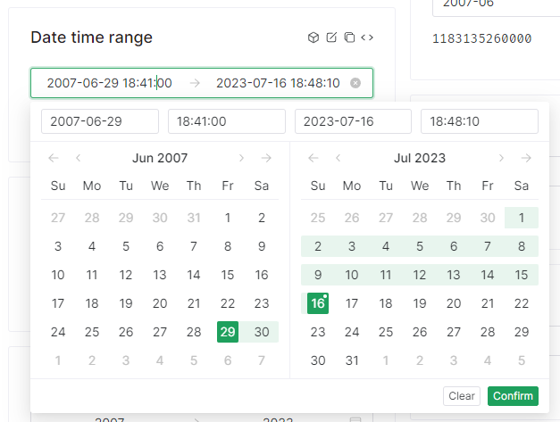
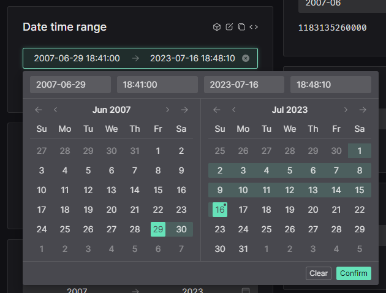

# Introduzione

## Acronimi

- **ARPA**: Agenzia Regionale per la Protezione Ambientale
- **HFS**: Hypermeteo Forecast System
- **HNS**: Hypermeteo Nowcasting System
- **OMM**: Organizzazione Mondiale della Meteorologia
- massima riflettività radar sulla verticale (VMI)
- Dipartimento della Protezione Civile (DPC)

## Presentazione

La piattaforma integrata di supporto meteorologico **MeteoCast** è un contenitore unico e personalizzabile di un insieme di prodotti e servizi meteorologici necessari al cliente per monitorare la situazione meteorologica in tempo reale, consultare dati storici e previsionali e richiedere servizi specifici di analisi dati in zone di interesse o servizi previsionali su misura.

Oltre che da browser, la piattaforma è consultabile, in modalità semplificata, anche da smartphone e tablet.

I servizi che possono essere attivati variano a seconda delle esigenze del cliente così come possono variare l'area geografica di interesse, l'intervallo temporale di consultazione del dato nel passato e nel futuro, il tipo di interazione con il dato e il numero di variabili meteorologiche.
Ciò rende MeteoCast una piattaforma altamente flessibile e adattabile a diverse necessità dell'utente finale.

Nel dettaglio la piattaforma, nella sua versione completa, è composta dai servizi che seguono:

- **RadarCast**: l'applicativo che consente la visualizzazione dei dati raccolti dalla rete nazionale di radar meteorologici opportunamente integrati con il mosaico radar dei Paesi limitrofi e che rende disponibili le previsioni a breve termine (_nowcasting_) calcolate a partire dai dati radar;  
- **GisMeteotrigger**: l'applicativo di visualizzazione del _database_ nazionale dei dati provenienti da stazioni meteorologiche certificate, ufficiali e conformi alle linee guida dell'Organizzazione Mondiale della Meteorologia (OMM);
- **RainGis** e **SnowGis**: i _software_ di visualizzazione dell'accumulata di precipitazione ottenuta dall'integrazione tra i dati radar e i dati pluviometrici;
- **Satelliti**: le immagini raccolte dai satelliti meteorologici disponibili;
- **Fulmini**: il servizio di monitoraggio di precisione dei fulmini e dei temporali;
- **Rianalisi**: l'applicativo che rende disponibili i dati della rianalisi meteorologica derivante dall'integrazione delle informazioni fornite dai modelli di simulazione meteorologica e dalle osservazioni raccolte da reti reali;
- **Indicatori di rischio meteoclimatico**: il servizio di visualizzazione degli indicatori di rischio meteoclimatico che descrivono la propensione al rischio rispetto a determinate avversità meteorologiche;
- **RainCast**: l'applicativo che fornisce previsioni sulle precipitazioni cumulate e i superamenti soglia previsti nelle prossime ore sulle diverse aree d'interesse;
- **Previsioni da modello**: l'applicativo che rende disponibili le mappe previsionali e i meteogrammi di diverse variabili meteorologiche fornite dai modelli previsionali meteorologici ad alta definizione Hypermeteo Forecast System (HFS) e Hypermeteo Nowcasting System (HNS);
- **Meteotrigger**: il servizio di fornitura di report e relazioni meteorologiche richieste dal cliente in punti o aree geografiche di interesse per specifici intervalli temporali;
- **Sintesi mensili**: il servizio documentale redatto a fini agricoli che analizza l'andamento meteorologico dei principali parametri meteorologici e i relativi superamenti di soglia;
- **Alert Ex-Post**: l'applicativo che fornisce il monitoraggio aggiornato delle avversità meteorologiche che si sono verificate in aree geografiche di interesse sulla base del superamento di soglie specifiche;
- **Allerta meteo**: il servizio di consultazione dei bollettini previsionali elaborati dai meteorologi
di Radarmeteo;
- **Reti e bollettini ufficiali**: il riferimento ai diversi _link_ esterni degli Enti predisposti al monitoraggio meteorologico e all'emissione dei bollettini ufficiali (es. ARPA, Dipartimento della Protezione Civile, ecc.).

Di seguito vengono elencate le funzionalità generali della piattaforma, viene descritta la disposizione dei servizi all'interno di essa e vengono delineati nello specifico i singoli servizi con un accenno all'elaborazione dei dati prima dell'esposizione al cliente.

## Accesso alla piattaforma

L'accesso al portale avviene tramite il collegamento all'indirizzo: [meteocast.radarmeteo.com](https://meteocast.radarmeteo.com/#/).

Il _link_ rimanda alla pagina di login riportata in Figura 1 dove viene richiesto all'utente l'inserimento delle proprie credenziali.

L'indirizzo di login, lo username e una password temporanea vengono forniti nella e-mail che viene inviata automaticamente, all'indirizzo di posta elettronica dell'utente, in fase di attivazione dell'account.

Al primo accesso viene chiesto all'utente di modificare la password temporanea al fine di definirne una personale e definitiva.

In seguito, la password può essere cambiata anche dopo la prima modifica obbligatoria semplicemente cliccando su “Reset password” e seguendo le informazioni fornite tramite mail.
Dopo l'inserimento delle credenziali, per accedere a MeteoCast è sufficiente cliccare su tasto “SIGN IN”.

!!! note

    ricordati di tradurre le stringhe. non mi piace che l'immagine sia a bassa risoluzione e allineata al bordo dello schermo. non mi piace il font. il colore del font non mi piace. i campi di testo non sono in material design come il resto dell'applicazione. quando si chiede di resettare la password il sign in viene semplicemente nascosto e riappare se si pigia il tasto "Back to Sign In". le toast notification prendono tutto lo spazio anche se non è necessario e i messaggi di errore sono in inglese quando l'utenza è in italiano, anche i placeholder sono in inglese. il textfield del verification code presenta le freccette per aumentare i numeri. non ci sono animazioni di nessun tipo, tutto avviene istantaneamente

!!! bug

    per qualche istante non viene caricata in tempo l'immagine e c'é un flash strano. probabilmente perché viene caricata in modalità _lazy_


## Requisiti minimi di sistema

La piattaforma non richiede requisiti minimi di sistema per i componenti hardware in quanto viene visualizzato tramite il _browser_ installato sul proprio sistema operativo.
Lato _software_, l'accesso al portale è possibile tramite qualsiasi _browser_ aggiornato;

## Interfaccia di Meteocast

L'interfaccia di MeteoCast dopo l'accesso è riportata in figura 2.
La cartina, che non ha limiti geografici, è generalmente centrata nell'area di interesse del cliente.
Le coordinate del centro dell'area e il livello di zoom sulla stessa sono scelte da un operatore di Radarmeteo in fase di configurazione dell'account del cliente e possono essere modificate su richiesta.
In basso a destra appare il logo dell'azienda della quale il cliente fa parte; anche in questo caso l'immagine viene caricata in fase di configurazione dell'account ed è modificabile su richiesta.

I tasti di colore bianco posizionati in alto a sinistra permettono di interagire con la mappa.
Le loro funzionalità sono riportate di seguito:

- tasto che permette di cercare una località di interesse tramite indirizzo o coordinate
geografiche;

- tasto che permette di sovrapporre alla cartina una serie di layer geografici globali o personalizzati;

- tasto che permette di effettuare la geolocalizzazione;
- tasti di zoom-in e zoom-out sulla cartina;

- tasto che permette di visualizzare la mappa in versione standard;
- tasto che permette di visualizzare la mappa con i rilievi;
- tasto che permette di visualizzare la mappa satellitare.

!!! note

    secondo me i tasti sono stati posizionati in alto a sinistra solo per comodità di programazione ma non è stato fatto nessuno studio sull'utilizzo da parte dell'utente della piattaforma. riposizionerei i tasti come interattivi come Google Maps
    come ci si muove sulla mappa? con il mouse? la barra spaziatrice? quali altri software utilizzano gli utenti con shortcut simili?

In particolare, quando si utilizzano le funzionalità di ricerca di una località o di geolocalizzazione la posizione richiesta viene visualizzata sulla mappa come riportato nell'esempio.

!!! note

    il nome dei layer presenta gli underscore e le voci sono troppo distanti fra di loro, italiane è una parola ripetuta tre volte, ci sono altre regione che possono essere presentate sulla cartina e c'é la necessità di specificare che sono italiane?

Nella barra nera a sinistra mostrata in figura 2 è presente il menù di navigazione principale le cui funzionalità sono elencate di seguito:

- tasto per visualizzare i servizi contenenti dati di archivio;
- tasto per visualizzare i servizi contenenti dati di tempo reale;
- tasto per visualizzare i servizi contenenti dati previsionali;
- tasto per visualizzare i servizi aggiuntivi che l'utente dispone (es. Alert Ex-Post®,
collegamenti a siti esterni, servizi documentali ecc.);
- tasto per utilizzare servizi di supporto operativo (es. Allerta meteo o Meteotrigger®);
- tasto per configurare alcune impostazioni relative al cliente (es. dati personali o caricamento di layer geografici personalizzati);
- tasto per visualizzare contatti, chiedere supporto o scaricare il disclaimer e i documenti di descrizione dei servizi;
- tasto per uscire dall'applicazione (logout).

!!! note

    i tasti delle impostazione è semplificabile e non presenta un'etichetta, il tasto per chiedere supporto ha troppe funzionalità associate e non presenta un'etichetta.

Le funzionalità a cui si ha accesso cliccando sui singoli tasti vengono dettagliate nelle sezioni successive.

## Servizi di Archivio, Tempo reale e Previsione

I tasti di "archivio", "tempo reale" e "previsione" permettono di accedere all'elenco di tutti i servizi contenenti rispettivamente i dati storici, i dati del tempo reale e i dati di previsione.
Ogni servizio contiene una o più variabili meteorologiche.
In particolare, le variabili contenute in un servizio possono ricadere in una delle seguenti categorie di dato:

- **vettoriale**: dati puntuali, definiti solo in corrispondenza di coordinate specifiche su mappa (es. i dati forniti dalle stazioni meteorologiche);
- **raster**: dati definiti su una griglia estesa e continua dove a ogni punto della griglia è sempre associato un valore (es. i dati di copertura radar o satellitare).

Le variabili meteorologiche relative a un servizio sono sempre della stessa tipologia.

Di seguito si riporta la descrizione di tutti i servizi di MeteoCast elencando le variabili
meteorologiche presenti in ognuno.

### RadarCast

Questo applicativo consente la visualizzazione dei dati raccolti o derivanti dalla rete italiana di radar meteorologici opportunamente integrati con il mosaico radar dei Paesi limitrofi.

Di seguito si elencano le sezioni in cui è presente tale servizio e le variabili meteorologiche di tipo _raster_ a esso associate:

- **Archivio**: dove si dispone dei dati storici presenti da gennaio 2020 ad oggi della massima riflettività radar sulla verticale (VMI) e della tipologia di precipitazione;
- **Tempo Reale**: dove sono presenti i dati relativi all'ultima ora della massima riflettività radar sulla verticale e della tipologia di precipitazione;
- **Previsione**: dove vengono fornite le previsioni di _nowcasting_ della massima riflettività radar sulla verticale.

La prima variabile meteorologica presente all'interno del servizio RadarCast è la massima riflettività radar sulla verticale che rappresenta una stima della quantità d'acqua presente nelle nubi ed è quindi fisicamente legata all'intensità di precipitazione.
All'interno del servizio si visualizza la riflettività dei radar italiani integrata con quella delle nazioni confinanti.
In particolare, in Italia questo tipo di dato è messo a disposizione dal Dipartimento della Protezione Civile (DPC) e copre tutto il territorio nazionale in quanto deriva dalla mosaicatura della riflettività di più di 20 radar posizionati sulla nostra penisola.
I radar attualmente attivi e coinvolti nella mosaicatura fornita dalla DPC sono i seguenti:

- Monte Armidda (NU);
- Bric della Croce (TO);
- San Pietro Capofiume (BO);
- Monte Crocione (LU);
- Fiumicino (RM);
- Fossalon (GO);
- Gattatico (RE);
- Monte Grande (PD);
- Monte Il Monte (CH);
- Monte Lauro (SR);
- Monte Macaion (TN);
- Monte Midia (AQ);
- Monte Pettinascura (CS);
- Monte Rasu (SS);
- Concordia Sagittaria (VE);
- Monte Serano (PG);
- Settepani (SV);
- Aeroporto di Napoli (NA);
- Aeroporto dello Stretto (RC);
- Aeroporto di Bari (BA);
- Aeroporto di Fontanarossa (CT);
- Monte Zoufplan (UD).

Il dato fornito dal DPC viene poi integrato con la massima riflettività sulla verticale del mosaico radar
della Slovenia attualmente composto da due radar:

- Podgorica, Sevnica;
- Bukov Vrh nad Visokim, Škofja Loka.

La seconda variabile meteorologica presente in questo servizio è la tipologia di precipitazione che
viene ricavata integrando il dato di riflettività con altri dati meteorologici servendosi di un algoritmo
che permette di distinguere i seguenti fenomeni:

- pioggia debole;
- pioggia forte;
- neve debole;
- neve forte;
- pioggia mista a neve;
- gelicidio;
- grandine;
- nubi.

La griglia geografica su cui le precedenti variabili sono espresse è di circa 1 km × 1 km, l'area di
interesse è centrata sull'Italia con latitudine e longitudine rispettivamente variabili nei range 35.4 ÷
48.2 e 3.02 ÷ 20.3.
L'intervallo temporale di aggiornamento del dato è di 5 min.

In Fig. 5 e Fig. 6 si riporta un esempio di visualizzazione su mappa rispettivamente per le variabili
riflettività e tipologia di precipitazione.

!!! note

    unita di misura dBz per la riflettività viene ripetuta 5 volte, manca lo spazio, 
    i simboli delle animazioni sembrano invertiti?? prima simboli di riproduzione e pausa, poi pausa, nessuna animazione, non si capisce molto, i tasti sono piccoli da pigiare, non si capiscono molto bene i bordi, una volta cliccato bisogna aspettare che l'animazione si carichi e l'utente non sa se sta ancora caricando o se l'animazione è effettivamente iniziata, magari posso risolvere temporaneamente colorando la card gradualmente?
    l'orario della riproduzione è piccola, non bisogna specificare "animazione" lo si sottointende
    quando viene specificata la variabile siamo sicuri che l'utente sappia che dbz è la riflettività? forse è meglio specificare "riflettività" e "tipologia di precipitazione"?
    prec_type non mi sembra un nome consono da mostrare all'utente, forse è meglio "tipologia di precipitazione"? la finestra che si apre, si apre sopra gli altri bottoni, bisogna scrollare per vedere tutti i valori, i colori sono stati scelti insieme al team? sono ottimali?
    non si capisce che cosa debba significare l'icona in alto a sinistra
    i tasti di fianco alla data servono per cancellarla, ma i tasti di fianco all'orario servono per cosa? per avere un altro orologio? non si capisce

Soluzione proposta: utilizzare un'altra libreria che abbia un date-time-picke con un intervallo di tempo minimo di 5 minuti, che abbia un'animazione più chiara e che abbia un'interfaccia più intuitiva e semplice da usare.

```typescript
<template>
  <n-date-picker v-model:value="range" type="datetimerange" clearable />
  <pre>{{ JSON.stringify(range) }}</pre>
</template>

// qui bisognerebbe utilizzare l'API script setup di Vue 3
// ed utilizzare la funzione Date per specificare la prima data disponibile per i dati
// bisognerebbe anche specificare la data massima disponibile per i dati
// e bisognerebbe anche mettere al corrente l'utente che i dati sono disponibili solo per un intervallo di tempo limitato
<script lang="ts">
import { defineComponent, ref } from 'vue'

export default defineComponent({
  setup () {
    return {
      range: ref<[number, number]>([1183135260000, Date.now()])
    }
  }
})
</script>
```

<https://www.naiveui.com/en-US/light/components/date-picker>





Il servizio previsionale di RadarCast mette a disposizione le previsioni di _nowcasting_ della massima riflettività radar per le successive 3 h a step di 5 min.
Queste previsioni stimano lo spostamento delle precipitazioni e un'eventuale intensificazione o riduzione delle stesse a partire dai dati di riflettività del mosaico radar.
Le previsioni sono ottenute dall'implementazione dell-algoritmo di Pulkkinen et al. (2020) presentato nel paper scientifico @Nowcasting of Convective Rainfall Using Volumetric Radar Observations”.
La griglia geografica su cui la variabile previsionale è espressa è la stessa usata per il dato osservato.

## GisMeteotrigger

Questo servizio consente la visualizzazione di tutti i dati raccolti dalle reti certificate, ufficiali o comunque conformi alle linee guida dell'Organizzazione Mondiale della Meteorologia (OMM).
Viene di seguito riportata una descrizione di ognuna delle tre tipologie di dati utilizzati:

- **dati certificati**: ossia rilevati da reti di stazioni che sono state sottoposte a procedure ufficiali di certificazione per quanto riguarda la tipologia di strumentazione installata, il
posizionamento dei siti di rilevazione, le procedure di manutenzione e la validazione dei dati;
- **dati ufficiali**: ossia rilevati da reti di stazioni afferenti ad enti ed organizzazioni governative legalmente preposti al monitoraggio meteorologico-ambientale (es. ARPA, Regioni ecc.);
- **dati a norma OMM**: ossia rilevati da reti di stazioni afferenti ad associazioni, organizzazioni non governative, enti/aziende di gestione del territorio (es. consorzi di bonifica, utilities, ecc.) che seguono le procedure di installazione, gestione, manutenzione e validazione definiti nei protocolli redatti dall'Organizzazione Mondiale della Meteorologia (OMM).

Le sezioni in cui è presente tale servizio e le variabili meteorologiche di tipo vettoriale ad esso associate sono elencate di seguito:

- **Archivio**: dove si dispone dei dati storici presenti da gennaio 2018 ad oggi dell'aggregato orario e da gennaio 1990 ad oggi dell'aggregato giornaliero di molteplici variabili meteorologiche registrate dalle stazioni;
- **Tempo Reale**: dove sono presenti i dati relativi alle ultime 12 h dell'aggregato orario di molteplici variabili meteorologiche registrate dalle stazioni.

Le variabili meteorologiche disponibili con aggregazione oraria hanno uno step di aggiornamento di 1 h e sono le seguenti:

- Temperatura (`°C`);
- Umidità relativa (`%`);
- Pressione al livello del mare (`hPa`);
- Precipitazioni 1h (`mm`);
- Intensità del vento (`m/s`);
- Direzione del vento (`°`);
- Radiazione solare (<code>W/m<sup>2</sup></code>);
- Livello idrometrico (`cm`);
- Temperatura al suolo (`°C`);
- Neve al suolo (`cm`);
- Visibilità (`m`);
- Indice UV;
- Bagnatura fogliare.

Le variabili meteorologiche disponibili con aggregazione giornaliera hanno uno step di aggiornamento di un giorno e sono le seguenti:

- Temperatura minima (`°C`);
- Temperatura massima (`°C`);
- Precipitazioni 24h (`mm`);
- Raffica massima (`m/s`).

In Fig. 7 e Fig. 8 è riportato un esempio di visualizzazione su mappa rispettivamente per la variabile oraria "Temperatura (`°C`)" e la variabile giornaliera "Precipitazioni 24h (`mm`)".

!!! note

    la mappa risulta essere ingombra, bisognerebbe trovare un modo per farla sembra meno piena. cluster?

## RainGis e SnowGis

RainGis è il servizio di visualizzazione della precipitazione accumulata sull'Italia.
Questa informazione viene ottenuta integrando:

- i dati dei radar meteorologici consultabili nella sezione dedicata a RadarCast;
- i dati pluviometrici di tutte le stazioni meteorologiche certificate, ufficiali e a norma consultabili nella sezione dedicata a GisMeteotrigger.

